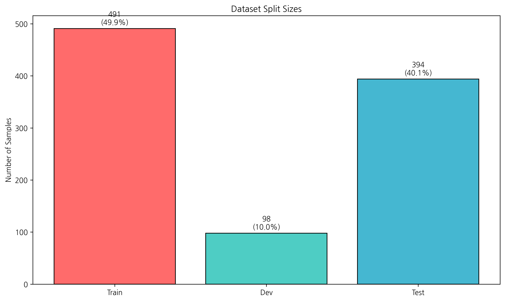
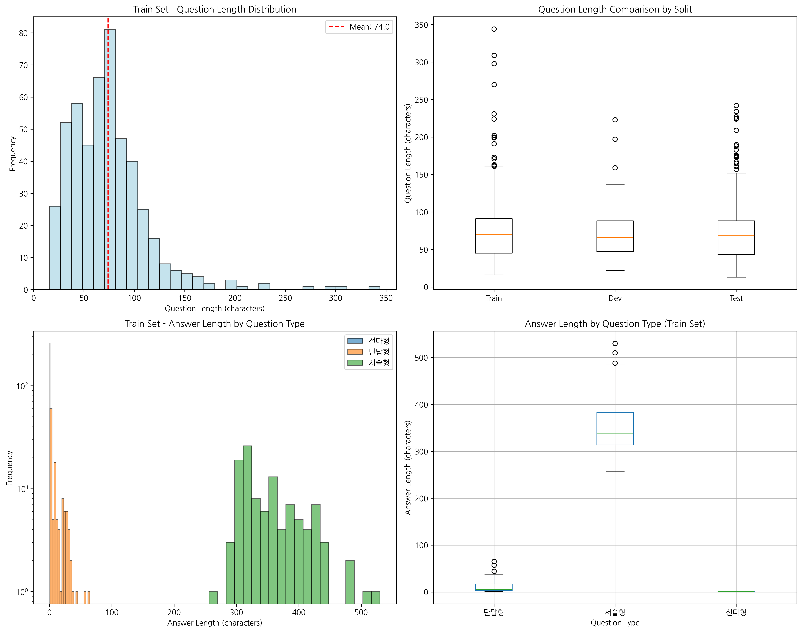
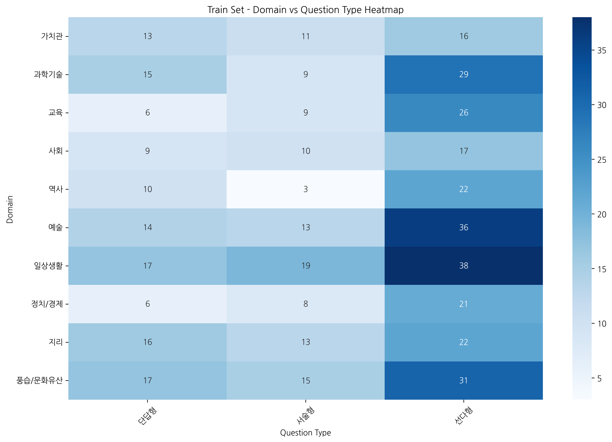
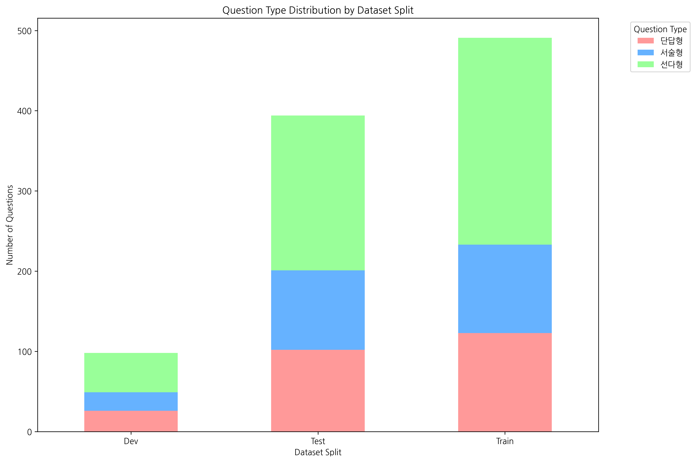
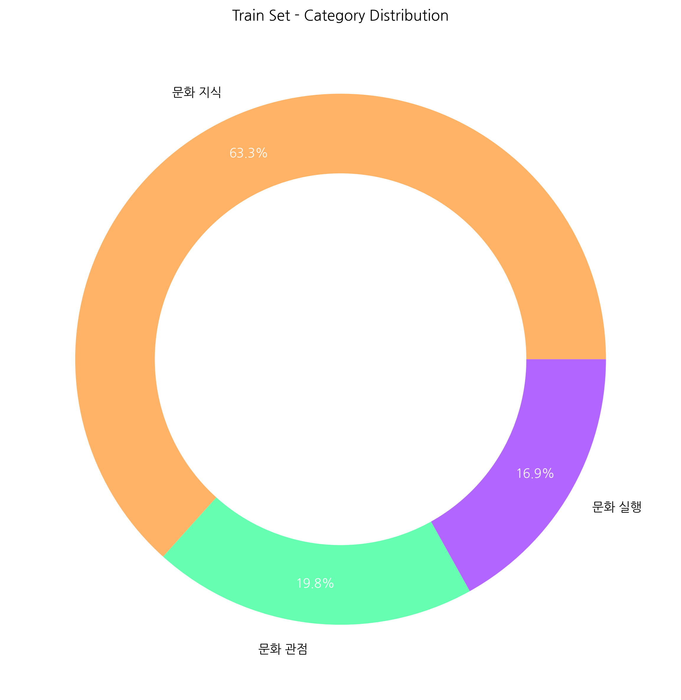
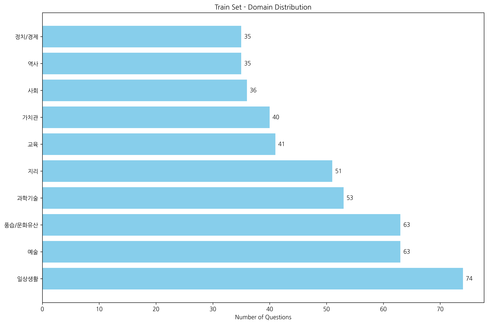
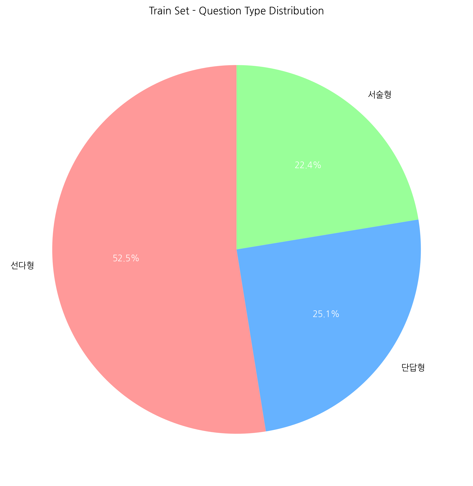
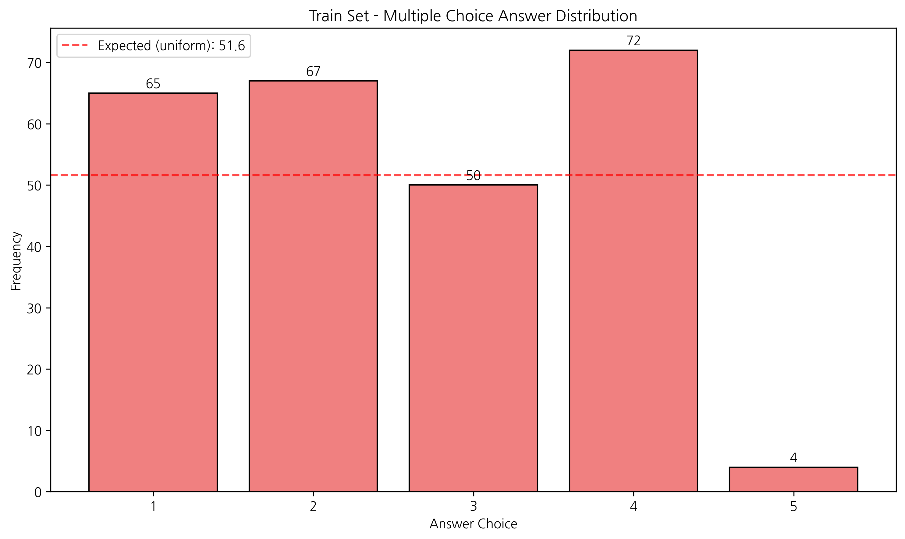
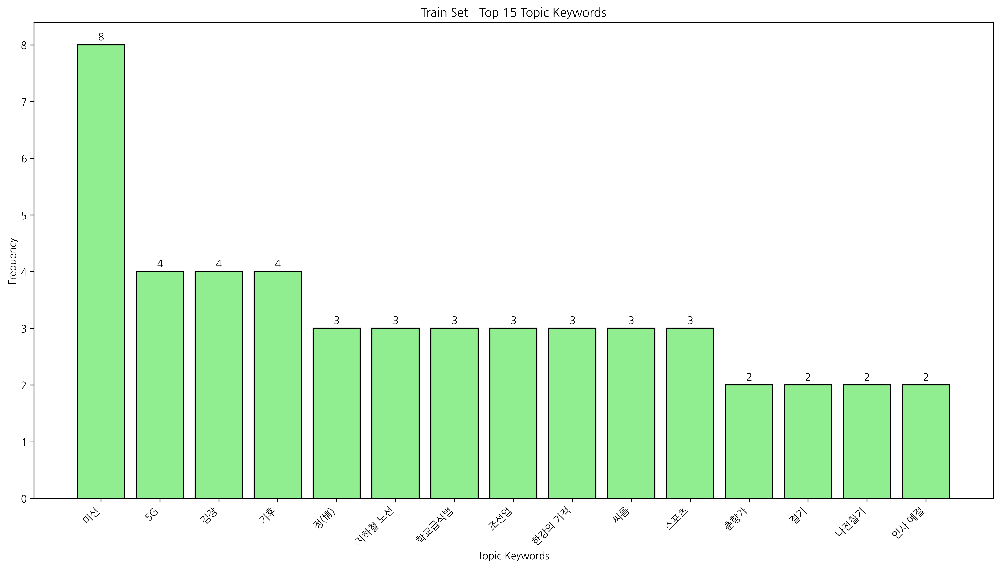
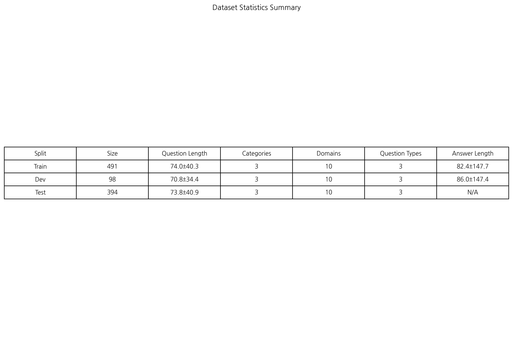

# 📊 데이터 분석 시각화 결과

## 1. 데이터 분할 정보

## 2. 질문 길이 분포

## 3. 도메인 × 질문 유형 분석

## 4. 데이터셋별 질문 유형 분포

## 5. 학습 데이터 통계

### 5-1. 카테고리 분포

### 5-2. 도메인 분포

### 5-3. 질문 유형 비율

### 5-4. 선다형 정답 번호 분포

### 5-5. 상위 토픽 키워드

## 6. 전체 통계 요약

